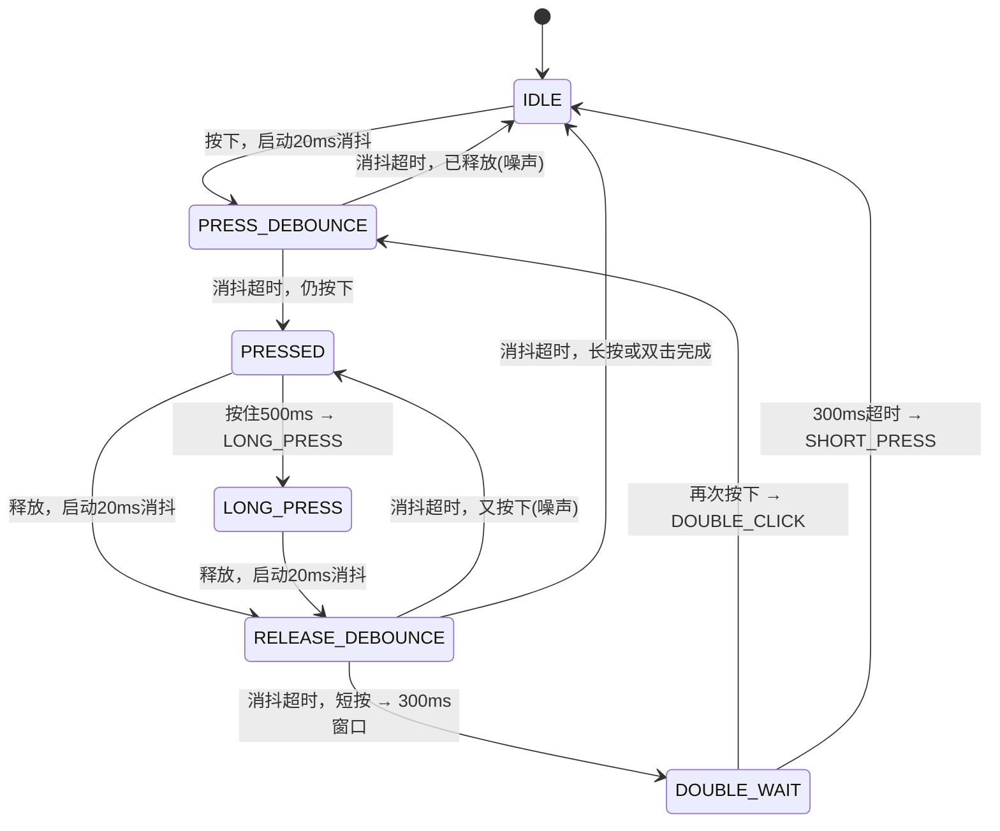

---
tags:
  - stm32
  - 状态机
  - 按键检测
  - 消抖
draft: false
published: 2026-05-31
title: 按键检测-无中断
category: 嵌入式
description: 按键状态机
---

# 按键状态机

## 状态图



## 事件定义

| 事件 | 触发条件 | 说明 |
|------|---------|------|
| `SHORT_PRESS` | 双击窗口超时，确认是单击 | 延迟 300ms 发出 |
| `LONG_PRESS` | 按住超过 500ms | 按下后持续保持 |
| `DOUBLE_CLICK` | 双击窗口内再次按下 | 第二次消抖成功后发出 |
| `RELEASED` | 每次确认释放 | 所有按键行为都会触发 |

## 时序图

### 短按 (Single Click)

```
按下        释放        300ms
 ├───────────┼───────────┤
 │           │           │
PRESS_DEBOUNCE→PRESSED→RELEASE_DEBOUNCE→DOUBLE_WAIT→IDLE
                              │                        ↑
                              └── RELEASED ────────────┘
                                                    SHORT_PRESS
```

### 长按 (Long Press)

```
按下        500ms       释放
 ├───────────────────────┼──────┤
 │                       │      │
PRESS_DEBOUNCE→PRESSED→LONG_PRESS→RELEASE_DEBOUNCE→IDLE
                         │           ↑
                         └─LONG_PRESS─┘
                                     RELEASED
```

### 双击 (Double Click)

```
第一次按下  释放       第二次按下  释放
 ├──────────┼───────────┼───────────┼──┤
 │          │           │           │
PRESS_DB→PRESSED→REL_DB→DOUBLE_WAIT→PRESS_DB→PRESSED→REL_DB→IDLE
                              │        ↑               ↑
                              └────────┘               RELEASED
                                      DOUBLE_CLICK
```

## 关键参数

| 参数 | 值 | 说明 |
|------|----|------|
| `KEY_DEBOUNCE_MS` | 20ms | 机械触点消抖时间 |
| `KEY_LONG_PRESS_MS` | 500ms | 长按判定阈值 |
| `KEY_DOUBLE_CLICK_MS` | 300ms | 双击等待窗口 |

## 标志位说明

| 标志 | 作用 |
|------|------|
| `is_long_press` | 标记当前是否处于长按状态，释放后直接回 IDLE |
| `is_double` | 标记是否来自双击窗口，消抖成功后发 `DOUBLE_CLICK` |
| `is_double_done` | 双击已完成，释放后不回 `DOUBLE_WAIT`，防止尾随 `SHORT_PRESS` |

## 源码

### Inc/key.h

```c
#ifndef __KEY_H
#define __KEY_H

#include "fsm.h"
#include "main.h"
#include <stdint.h>

typedef enum {
    KEY_EVENT_NONE = 0,
    KEY_EVENT_SHORT_PRESS,
    KEY_EVENT_LONG_PRESS,
    KEY_EVENT_DOUBLE_CLICK,
    KEY_EVENT_RELEASED,
} key_event_t;

typedef enum {
    KEY_FSM_IDLE,
    KEY_FSM_PRESS_DEBOUNCE,
    KEY_FSM_PRESSED,
    KEY_FSM_LONG_PRESS,
    KEY_FSM_RELEASE_DEBOUNCE,
    KEY_FSM_DOUBLE_WAIT,
} key_fsm_state_t;

#define KEY_DEBOUNCE_MS     20
#define KEY_LONG_PRESS_MS   500
#define KEY_DOUBLE_CLICK_MS 300

typedef struct {
    fsm_timer_t timer;
    key_fsm_state_t state;
    GPIO_TypeDef* gpiox;
    uint16_t pin;
    uint8_t active_level;
    key_event_t event;
    uint8_t is_long_press;
    uint8_t is_double;
    uint8_t is_double_done;
} key_fsm_t;

void key_fsm_init(key_fsm_t* key, GPIO_TypeDef* gpiox, uint16_t pin, uint8_t active_level);
void key_fsm_tick(void* instance);
key_event_t key_get_event(key_fsm_t* key);

#endif
```

### Src/key.c

```c
#include "key.h"
#include "main.h"

static uint8_t key_is_pressed(key_fsm_t* key) {
    return HAL_GPIO_ReadPin(key->gpiox, key->pin) == key->active_level;
}

void key_fsm_init(key_fsm_t* key, GPIO_TypeDef* gpiox, uint16_t pin, uint8_t active_level) {
    key->gpiox = gpiox;
    key->pin = pin;
    key->active_level = active_level;
    key->state = KEY_FSM_IDLE;
    key->event = KEY_EVENT_NONE;
    key->is_long_press = 0;
    key->is_double = 0;
    key->is_double_done = 0;
}

void key_fsm_tick(void* instance) {
    key_fsm_t* key = (key_fsm_t*)instance;
    if (!key) return;

    key->event = KEY_EVENT_NONE;

    switch (key->state) {
        case KEY_FSM_IDLE:
            if (key_is_pressed(key)) {
                fsm_timer_init(&key->timer, KEY_DEBOUNCE_MS);
                fsm_timer_start(&key->timer);
                key->state = KEY_FSM_PRESS_DEBOUNCE;
            }
            break;

        case KEY_FSM_PRESS_DEBOUNCE:
            if (fsm_timer_expired(&key->timer)) {
                if (key_is_pressed(key)) {
                    if (key->is_double) {
                        key->event = KEY_EVENT_DOUBLE_CLICK;
                        key->is_double = 0;
                        key->is_double_done = 1;
                    }
                    fsm_timer_init(&key->timer, KEY_LONG_PRESS_MS);
                    fsm_timer_start(&key->timer);
                    key->state = KEY_FSM_PRESSED;
                } else {
                    key->is_double = 0;
                    key->state = KEY_FSM_IDLE;
                }
            }
            break;

        case KEY_FSM_PRESSED:
            if (!key_is_pressed(key)) {
                key->is_long_press = 0;
                fsm_timer_init(&key->timer, KEY_DEBOUNCE_MS);
                fsm_timer_start(&key->timer);
                key->state = KEY_FSM_RELEASE_DEBOUNCE;
            } else if (!key->is_double_done && fsm_timer_expired(&key->timer)) {
                key->event = KEY_EVENT_LONG_PRESS;
                key->is_long_press = 1;
                key->state = KEY_FSM_LONG_PRESS;
            }
            break;

        case KEY_FSM_LONG_PRESS:
            if (!key_is_pressed(key)) {
                fsm_timer_init(&key->timer, KEY_DEBOUNCE_MS);
                fsm_timer_start(&key->timer);
                key->state = KEY_FSM_RELEASE_DEBOUNCE;
            }
            break;

        case KEY_FSM_RELEASE_DEBOUNCE:
            if (fsm_timer_expired(&key->timer)) {
                if (!key_is_pressed(key)) {
                    key->event = KEY_EVENT_RELEASED;
                    if (key->is_long_press || key->is_double_done) {
                        key->is_double_done = 0;
                        key->state = KEY_FSM_IDLE;
                    } else {
                        fsm_timer_init(&key->timer, KEY_DOUBLE_CLICK_MS);
                        fsm_timer_start(&key->timer);
                        key->state = KEY_FSM_DOUBLE_WAIT;
                    }
                } else {
                    key->state = KEY_FSM_PRESSED;
                    fsm_timer_init(&key->timer, KEY_LONG_PRESS_MS);
                    fsm_timer_start(&key->timer);
                }
            }
            break;

        case KEY_FSM_DOUBLE_WAIT:
            if (key_is_pressed(key)) {
                key->is_double = 1;
                fsm_timer_init(&key->timer, KEY_DEBOUNCE_MS);
                fsm_timer_start(&key->timer);
                key->state = KEY_FSM_PRESS_DEBOUNCE;
            } else if (fsm_timer_expired(&key->timer)) {
                key->event = KEY_EVENT_SHORT_PRESS;
                key->state = KEY_FSM_IDLE;
            }
            break;
    }
}

key_event_t key_get_event(key_fsm_t* key) {
    key_event_t e = key->event;
    key->event = KEY_EVENT_NONE;
    return e;
}
```

## 使用示例

```c
#include "key.h"

key_fsm_t key;

void main(void) {
    // 初始化: GPIOG Pin13, 低电平按下
    key_fsm_init(&key, KEY_GPIO_Port, KEY_Pin, GPIO_PIN_RESET);

    // 注册到调度器
    fsm_scheduler_add(&scheduler, &key, key_fsm_tick);

    while (1) {
        fsm_scheduler_run(&scheduler);

        key_event_t evt = key_get_event(&key);
        switch (evt) {
            case KEY_EVENT_SHORT_PRESS:
                // 单击
                break;
            case KEY_EVENT_LONG_PRESS:
                // 长按
                break;
            case KEY_EVENT_DOUBLE_CLICK:
                // 双击
                break;
            case KEY_EVENT_RELEASED:
                // 释放
                break;
        }
    }
}
```

## 设计要点

1. **延迟决策**: 按下时暂不发出事件，等待超时或双击窗口来区分短按/双击/长按
2. **双击防尾随**: `is_double_done` 标记确保双击完成后释放直接回 IDLE，不会进入 `DOUBLE_WAIT` 产生多余的 `SHORT_PRESS`
3. **电平可配**: `active_level` 参数适应高/低电平按下的按键电路

## 局限与缺点

### 1. 单击响应延迟 300ms

`SHORT_PRESS` 必须等 `DOUBLE_WAIT` 超时才能发出，导致单击操作有 300ms 的延迟感。这是"区分单击和双击"的固有代价——在双击窗口关闭之前无法确认是单击。

### 2. 双击后无法立即单击

双击完成后回 `IDLE`，但如果用户紧接着快速第三次按下，将重新开始一个完整的短按流程（又要等 300ms）。双击后想立即单击会觉得不流畅。

### 3. 双击窗口内长按行为异常

`DOUBLE_WAIT` 内如果按下并保持，会先发 `DOUBLE_CLICK` 进入 `PRESSED`，此时 `is_double_done` 阻止了长按检测，继续按住也不会触发 `LONG_PRESS`。即：
- 快速双击 → 正常识别为 `DOUBLE_CLICK`
- 慢速双击（第二次按下后不松手）→ 发 `DOUBLE_CLICK`，但不会触发 `LONG_PRESS`

### 4. `LONG_PRESS` 只触发一次

按住不放时 `LONG_PRESS` 只发出一次，不会持续重复触发。某些场景（如连续调节音量）需要按住时重复触发，需自行在应用层实现。

### 5. 不支持多击

只支持双击，无法扩展为三击、四击等多击识别。如果需求增加，需要重新设计状态机或改用计数器方案。

### 6. 不支持按键组合

无法检测同时按下多个键，每个 `key_fsm_t` 实例独立运行，互不知晓彼此状态。

### 7. 轮询驱动，精度受调度影响

依赖 `fsm_scheduler_run` 定期调用 `tick`，如果主循环阻塞或调度间隔不稳定，消抖精度和长按/双击计时会受影响。需要保证 `tick` 调用间隔 ≤ 消抖时间（20ms）才能可靠工作。

### 8. 无中断支持

当前是纯轮询方式，如果主循环被长时间阻塞（如等待 Flash 写入、延时较大的外设操作），可能丢失按键事件。对实时性要求高的场景应考虑使用 EXTI 中断 + 标志位的方式。

### 9. 每个按键实例占用固定内存

```c
typedef struct {
    fsm_timer_t timer;      // 12 bytes
    key_fsm_state_t state;  // 4 bytes
    GPIO_TypeDef* gpiox;    // 4 bytes
    uint16_t pin;           // 2 bytes
    uint8_t active_level;   // 1 byte
    key_event_t event;      // 4 bytes
    uint8_t is_long_press;  // 1 byte
    uint8_t is_double;      // 1 byte
    uint8_t is_double_done; // 1 byte
} key_fsm_t; // ~30 bytes per key
```
